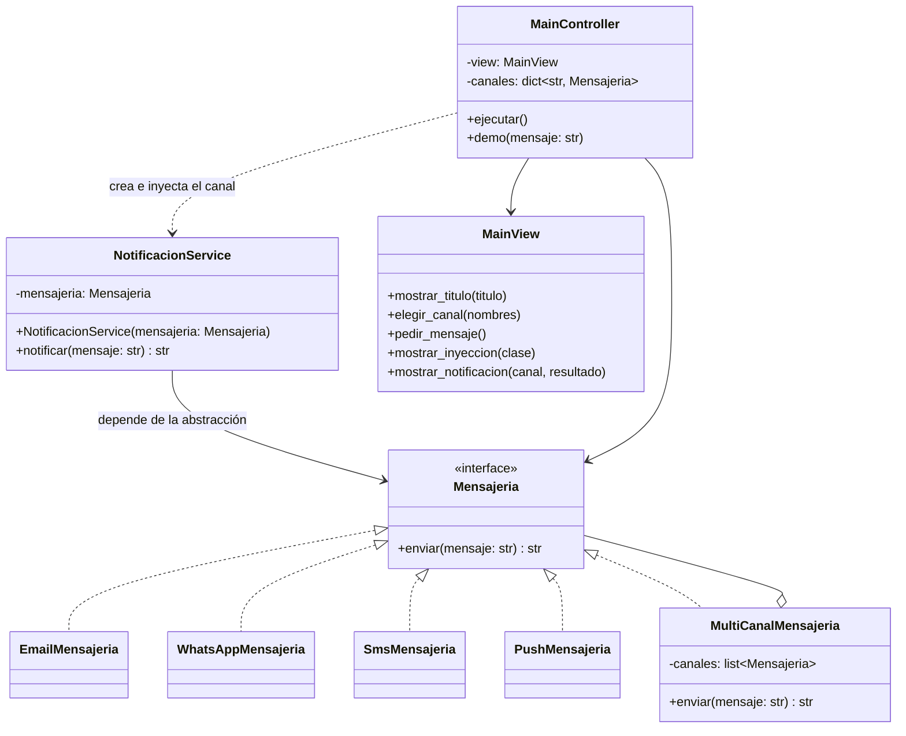

# Diagrama UML de clases (solución final)

```mermaid
classDiagram
    class Mensajeria {
        <<interface>>
        +enviar(mensaje: str) str
    }
    class EmailMensajeria
    class WhatsAppMensajeria
    class SmsMensajeria
    class PushMensajeria
    class MultiCanalMensajeria {
        -canales: list~Mensajeria~
        +enviar(mensaje: str) str
    }
    class NotificacionService {
        -mensajeria: Mensajeria
        +NotificacionService(mensajeria: Mensajeria)
        +notificar(mensaje: str) str
    }
    class MainController {
        -view: MainView
        -canales: dict~str, Mensajeria~
        +ejecutar()
        +demo(mensaje: str)
    }
    class MainView {
        +mostrar_titulo(titulo)
        +elegir_canal(nombres)
        +pedir_mensaje()
        +mostrar_inyeccion(clase)
        +mostrar_notificacion(canal, resultado)
    }
    Mensajeria <|.. EmailMensajeria
    Mensajeria <|.. WhatsAppMensajeria
    Mensajeria <|.. SmsMensajeria
    Mensajeria <|.. PushMensajeria
    Mensajeria <|.. MultiCanalMensajeria
    MultiCanalMensajeria o-- Mensajeria
    NotificacionService --> Mensajeria : depende de la abstracción
    MainController ..> NotificacionService : crea e inyecta el canal
    MainController --> Mensajeria
    MainController --> MainView
```
